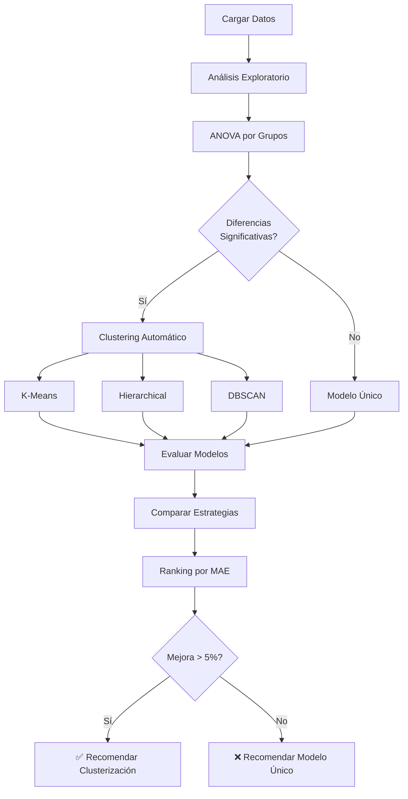

# 🎯 Análisis de Clusterización - Guía Rápida

## 🚀 Inicio Rápido

### Opción 1: Ejecutar con un click (Windows)
```bash
# Doble click en:
ejecutar_analisis.bat
```

### Opción 2: Línea de comandos
```bash
# 1. Instalar dependencias
pip install -r requirements.txt

# 2. Ejecutar análisis
python analisis_clusterizacion_avanzado.py
```

---

## 📊 ¿Qué hace este análisis?

### Pregunta Central
> **¿Es mejor tener 1 modelo único o múltiples modelos especializados por clusters?**

### Estrategias Comparadas

| # | Estrategia | N° Modelos | Descripción |
|---|-----------|-----------|-------------|
| 1 | **Modelo Único** | 1 | Un solo modelo para todos los datos (baseline) |
| 2 | **Por Sexo** | 2 | Un modelo para HEMBRA, otro para MACHO |
| 3 | **Por Densidad** | ~7 | Un modelo por cada densidad de pollos/m² |
| 4 | **Por Tipo Construcción** | 3 | Tradicional / Transversal / Black Out |
| 5 | **Por Sector** | ~9 | Un modelo por cada sector geográfico |
| 6 | **K-Means** | 2-10 | Clustering automático (K óptimo) |
| 7 | **Hierarchical** | 2-10 | Clustering jerárquico |
| 8 | **DBSCAN** | Variable | Clustering por densidad |

---

## 📈 Métricas Evaluadas

### Para Cada Estrategia se Calcula:

| Métrica | Descripción | Mejor Valor |
|---------|-------------|-------------|
| **MAE** | Error Absoluto Medio | ⬇️ Menor |
| **RMSE** | Raíz del Error Cuadrático Medio | ⬇️ Menor |
| **R²** | Coeficiente de Determinación | ⬆️ Mayor |
| **CV MAE** | MAE con Validación Cruzada | ⬇️ Menor |

### Interpretación de MAE (Error en gramos)

| Rango MAE | Calidad |
|-----------|---------|
| < 3.0 | ⭐⭐⭐ Excelente |
| 3.0 - 5.0 | ⭐⭐ Bueno |
| 5.0 - 7.0 | ⭐ Aceptable |
| > 7.0 | ❌ Necesita Mejora |

---

## 🔬 Análisis Estadístico

### ANOVA (Analysis of Variance)
Determina si hay **diferencias significativas** entre grupos:

```
p-value < 0.05  →  ✅ Diferencias significativas (clusterizar puede ayudar)
p-value ≥ 0.05  →  ❌ No hay diferencias (modelo único es suficiente)
```

### Métricas de Clustering

| Métrica | Rango | Bueno |
|---------|-------|-------|
| **Silhouette** | -1 a 1 | > 0.5 |
| **Davies-Bouldin** | 0 a ∞ | < 1.0 |
| **Calinski-Harabasz** | 0 a ∞ | > 100 |

---

## 📁 Archivos Generados

### 🖼️ Visualizaciones

```
📊 comparacion_estrategias.png
   ├── MAE por estrategia
   ├── RMSE por estrategia
   ├── R² por estrategia
   └── CV MAE por estrategia

📊 kmeans_metricas.png
   ├── Elbow Curve (Inertia)
   ├── Silhouette Score
   └── Davies-Bouldin Score

📊 visualizacion_clusters.png
   ├── K-Means en PCA
   ├── Hierarchical en PCA
   └── Distribución por Sexo

📊 dendrograma.png
   └── Árbol jerárquico de clusters
```

### 📄 Datos y Reportes

```
📋 comparacion_estrategias.csv
   └── Tabla comparativa de todas las estrategias

📋 resultados_detallados.json
   └── Resultados completos con métricas por grupo

📋 dataset_con_clusters.csv
   └── Dataset original + asignaciones de clusters

📋 REPORTE_CLUSTERIZACION.md
   └── Reporte ejecutivo con recomendación final
```

---

## 🎯 Criterios de Decisión

### ✅ USAR CLUSTERIZACIÓN si:

1. **Mejora > 5%** vs baseline
2. **ANOVA p-value < 0.05** (diferencias significativas)
3. **Silhouette Score > 0.5** (clusters bien definidos)
4. **Beneficio justifica complejidad** operacional

### ⚠️ EVALUAR TRADE-OFF si:

1. **Mejora 1-5%** (marginal)
2. **Recursos limitados** para mantenimiento
3. **Alta complejidad** operacional

### ❌ MANTENER MODELO ÚNICO si:

1. **Mejora < 1%** o negativa
2. **ANOVA p-value > 0.05** (sin diferencias)
3. **Silhouette < 0.3** (clusters mal definidos)
4. **Simplicidad es prioritaria**

---

## 📊 Flujo del Análisis



---

## 🔧 Personalización Avanzada

### Modificar Rango de K para K-Means
```python
# En el archivo analisis_clusterizacion_avanzado.py línea ~138
k_range = range(2, 15)  # Probar de 2 a 14 clusters
```

### Cambiar Modelo de Predicción
```python
# Reemplazar RandomForest con XGBoost
from xgboost import XGBRegressor
model = XGBRegressor(n_estimators=100, learning_rate=0.1)
```

### Ajustar DBSCAN
```python
# Mayor eps = clusters más grandes
# Mayor min_samples = clusters más densos
dbscan = DBSCAN(eps=3.0, min_samples=10)
```

---

## 💡 Tips y Mejores Prácticas

### 1. Interpretación de Resultados
- **Priorizar MAE** sobre otras métricas (más interpretable)
- **Validar con cross-validation** (CV MAE)
- **Considerar R²** para entender varianza explicada

### 2. Clusters Óptimos
- **K-Means**: Usar Silhouette Score para elegir K
- **Hierarchical**: Revisar dendrograma para cortes naturales
- **DBSCAN**: Ajustar eps según densidad esperada

### 3. Producción
- **Documentar** qué estrategia se eligió y por qué
- **Versionado** de modelos por cluster
- **Monitoreo** de drift en cada cluster

### 4. Mantenimiento
- **Re-entrenar** cuando hay suficiente data nueva
- **Validar** estabilidad de clusters en el tiempo
- **A/B Testing** antes de desplegar cambios

---

## 🐛 Solución de Problemas

### Error: ModuleNotFoundError
```bash
pip install -r requirements.txt
```

### Error: MemoryError
```python
# Reducir n_estimators o usar max_samples
rf = RandomForestRegressor(n_estimators=50, max_samples=0.5)
```

### Warning: ConvergenceWarning
```python
# Aumentar max_iter en K-Means
kmeans = KMeans(n_clusters=k, max_iter=500)
```

### Gráficos no se ven
```python
# Agregar al final del script
plt.show()
```

---

## 📚 Referencias

### Algoritmos
- [K-Means Clustering](https://scikit-learn.org/stable/modules/clustering.html#k-means)
- [Hierarchical Clustering](https://scikit-learn.org/stable/modules/clustering.html#hierarchical-clustering)
- [DBSCAN](https://scikit-learn.org/stable/modules/clustering.html#dbscan)

### Métricas
- [Silhouette Score](https://scikit-learn.org/stable/modules/clustering.html#silhouette-coefficient)
- [Davies-Bouldin Index](https://scikit-learn.org/stable/modules/clustering.html#davies-bouldin-index)
- [Calinski-Harabasz Index](https://scikit-learn.org/stable/modules/clustering.html#calinski-harabasz-index)

### Modelos
- [Random Forest](https://scikit-learn.org/stable/modules/ensemble.html#random-forests)
- [Cross-Validation](https://scikit-learn.org/stable/modules/cross_validation.html)

---

## 📞 Contacto

Para preguntas o mejoras:
- **Email**: datascienceteam@tecnoandina.com
- **Documentación**: `C:\tecnoandina\f35_modelacion2\docs`

---

**Última Actualización:** 2025-10-05  
**Versión:** 1.0  
**Proyecto:** F35 Modelación - Predicción de Ganancia en Pollos
