# 🚀 GUÍA RÁPIDA - Clusterización Simplificada

## ⚡ INICIO EN 30 SEGUNDOS

```bash
1. 📂 Ir a: C:\tecnoandina\f35_modelacion2\analisis\clusterizacion2\
2. 🖱️ Doble click: ejecutar_analisis.bat
3. ⏱️ Esperar: 2-5 minutos
4. 📄 Abrir: REPORTE_CLUSTERIZACION.md
```

---

## 🎯 ¿QUÉ HACE ESTE ANÁLISIS?

Responde la pregunta:

> **¿Debo crear modelos separados por Sexo, Densidad o Tipo de Construcción?**

### Variables Consideradas (Solo 3)
- ✅ **Sexo** (HEMBRA/MACHO)
- ✅ **Densidad** (pollos/m²)
- ✅ **Tipo Construcción** (Tradicional/Transversal/Black Out)

### Variables NO Consideradas
- ❌ Sector (para simplicidad)
- ❌ Otras variables geográficas/temporales

---

## 📊 ESTRATEGIAS EVALUADAS

| # | Estrategia | N° Modelos | Descripción |
|---|-----------|------------|-------------|
| 1 | **Modelo Único** | 1 | Baseline - un solo modelo para todo |
| 2 | **Por Sexo** | 2 | HEMBRA y MACHO separados |
| 3 | **Por Tipo Construcción** | 3 | Tradicional, Transversal, Black Out |
| 4 | **K-Means** | K óptimo | Clustering automático |
| 5 | **Hierarchical** | K óptimo | Clustering jerárquico |

---

## 📈 CRITERIOS DE DECISIÓN

```mermaid
graph TD
    A[Mejora vs Baseline] --> B{¿Cuánto?}
    B -->|> 5%| C[✅ IMPLEMENTAR]
    B -->|1-5%| D[⚠️ EVALUAR COSTO/BENEFICIO]
    B -->|< 1%| E[❌ MANTENER MODELO ÚNICO]
    
    C --> F[Crear modelos separados]
    D --> G[Analizar complejidad vs beneficio]
    E --> H[Optimizar modelo único]
```



### Tabla de Decisión

| Mejora MAE | Acción | Razón |
|-----------|--------|-------|
| **> 5%** | ✅ Implementar clustering | Beneficio claro |
| **1-5%** | ⚠️ Evaluar trade-off | Marginal |
| **< 1%** | ❌ Modelo único | No vale la pena |

---

## 🔍 MÉTRICAS EXPLICADAS

### MAE (Mean Absolute Error) 📏
```
MAE = Promedio(|Real - Predicción|)
```
- Error promedio en gramos
- **Menor es mejor**
- Ejemplo: MAE=1.5 → error de ±1.5g en promedio

### RMSE (Root Mean Squared Error) 📐
```
RMSE = √(Promedio((Real - Predicción)²))
```
- Penaliza errores grandes
- **Menor es mejor**

### R² (R-squared) 📊
```
R² = 1 - (Varianza residual / Varianza total)
```
- % de varianza explicada
- **Mayor es mejor** (0-1)
- R²=0.90 → modelo explica 90%

### CV MAE (Cross-Validation) ✅
- MAE en validación cruzada (5 folds)
- Indica generalización
- **Menor es mejor**

---

## 🎨 VISUALIZACIONES GENERADAS

### 1. **comparacion_estrategias.png** 📊
4 gráficos de barras:
- MAE por estrategia
- RMSE por estrategia  
- R² por estrategia
- CV MAE por estrategia

### 2. **kmeans_metricas.png** 📈
3 gráficos para determinar K óptimo:
- Elbow Curve (inercia)
- Silhouette Score
- Davies-Bouldin Score

### 3. **visualizacion_clusters.png** 🔍
3 proyecciones PCA:
- K-Means clusters
- Hierarchical clusters
- Distribución por Sexo

### 4. **dendrograma.png** 🌳
- Árbol jerárquico
- Últimas 30 fusiones

---

## 📁 ARCHIVOS DE SALIDA

### Visualizaciones (PNG)
```
📊 comparacion_estrategias.png  - Comparación de estrategias
📈 kmeans_metricas.png          - Métricas de clustering
🔍 visualizacion_clusters.png   - PCA de clusters
🌳 dendrograma.png               - Clustering jerárquico
```

### Datos (CSV/JSON)
```
📄 comparacion_estrategias.csv  - Tabla Excel
📋 resultados_detallados.json   - JSON completo
💾 dataset_con_clusters.csv     - Dataset + clusters
```

### Reporte (MD)
```
📝 REPORTE_CLUSTERIZACION.md    - Reporte ejecutivo ⭐
```

---

## 🔬 PROCESO DEL ANÁLISIS

```mermaid
graph LR
    A[Cargar Datos] --> B[Limpiar]
    B --> C[ANOVA]
    C --> D[Clustering]
    D --> E[Evaluar Estrategias]
    E --> F[Comparar Métricas]
    F --> G[Recomendación]
    
    style A fill:#e1f5fe
    style G fill:#c8e6c9
```



### Paso a Paso

1. **Cargar datos** 📂
   - Lee `resumen_crianzas_para_modelo2.csv`
   - Filtra variables: sexo, densidad, tipo construcción

2. **Análisis ANOVA** 📊
   - Evalúa diferencias significativas entre grupos
   - p-value < 0.05 → grupos diferentes

3. **Clustering automático** 🔍
   - K-Means: encuentra K óptimo (Silhouette)
   - Hierarchical: clustering jerárquico
   - DBSCAN: detección de outliers

4. **Evaluar estrategias** 🧪
   - Entrena modelos para cada estrategia
   - Calcula MAE, RMSE, R², CV MAE

5. **Comparar resultados** 📈
   - Ordena por MAE (mejor a peor)
   - Calcula mejora vs baseline

6. **Generar reporte** 📝
   - Visualizaciones
   - Tablas comparativas
   - Recomendación final

---

## 📖 CÓMO LEER EL REPORTE

### 1. Abrir `REPORTE_CLUSTERIZACION.md`

### 2. Ir a "Mejor Estrategia"
```markdown
🏆 MEJOR ESTRATEGIA: [Nombre]
Métricas:
  • MAE: X.XXXX
  • RMSE: X.XXXX
  • R²: X.XXXX
  • Modelos: X
```

### 3. Revisar mejora
```markdown
📈 Mejora vs Baseline: X.XX%
```

### 4. Leer recomendación
- ✅ Implementar → Mejora > 5%
- ⚠️ Evaluar → Mejora 1-5%
- ❌ Mantener único → Mejora < 1%

### 5. Ver visualizaciones
```bash
# Abrir imágenes PNG
comparacion_estrategias.png
visualizacion_clusters.png
```

---

## 💡 TIPS Y BUENAS PRÁCTICAS

### ✅ Hacer
- Ejecutar con datos limpios
- Revisar REPORTE primero
- Comparar con baseline
- Considerar complejidad operacional

### ❌ Evitar
- Ignorar la mejora porcentual
- Implementar sin evaluar costo
- Usar K muy alto sin justificación
- Decidir solo por R²

---

## 🆚 COMPARACIÓN CON ANÁLISIS ORIGINAL

| Aspecto | `clusterizacion` | `clusterizacion2` |
|---------|-----------------|-------------------|
| **Variables** | Todas (13) | Solo 3 principales |
| **Estrategias** | 8 | 5 |
| **Incluye Sector** | ✅ Sí | ❌ No |
| **Tiempo** | 5-10 min | 2-5 min |
| **Complejidad** | Alta | Media |
| **Enfoque** | Exhaustivo | Operacional |
| **Uso** | Investigación | Implementación |

### ¿Cuándo usar cada uno?

**`clusterizacion` (Original)** 🔬
- Análisis exploratorio completo
- Incluir análisis por sector
- Investigación exhaustiva
- Tiempo no es factor

**`clusterizacion2` (Simplificado)** ⚡
- Enfoque en variables operacionales
- Resultados rápidos
- Implementación práctica
- Simplicidad es prioridad

---

## 🚨 SOLUCIÓN DE PROBLEMAS

### Error: Python no encontrado
```bash
# Instalar Python 3.8+
# Agregar al PATH
python --version
```

### Error: Dependencias faltantes
```bash
pip install -r requirements.txt
```

### Error: Archivo no encontrado
```bash
# Verificar ruta del dataset
../../resumen_crianzas_para_modelo2.csv
```

### Error: Sin memoria
```bash
# Reducir número de estimators
# En línea ~200 del script:
RandomForestRegressor(n_estimators=50)  # en vez de 100
```

---

## 🎯 ESCENARIOS DE USO

### Escenario 1: Evaluación Rápida ⚡
```
Situación: Necesito saber si vale la pena clusterizar
Acción: Ejecutar clusterizacion2
Tiempo: 2-5 minutos
Resultado: Recomendación clara
```

### Escenario 2: Análisis Completo 🔬
```
Situación: Quiero explorar todas las opciones
Acción: Ejecutar clusterizacion original
Tiempo: 5-10 minutos
Resultado: Análisis exhaustivo
```

### Escenario 3: Implementación 🚀
```
Situación: Voy a deployar el modelo
Acción: Usar clusterizacion2 para decidir
Resultado: Estrategia operacional clara
```

---

## 📝 CHECKLIST PRE-EJECUCIÓN

- [ ] Python 3.8+ instalado
- [ ] Dataset disponible: `../../resumen_crianzas_para_modelo2.csv`
- [ ] Espacio en disco: ~100 MB
- [ ] Tiempo disponible: 5 minutos
- [ ] Dependencias instaladas

---

## 📝 CHECKLIST POST-EJECUCIÓN

- [ ] Revisar `REPORTE_CLUSTERIZACION.md`
- [ ] Analizar `comparacion_estrategias.png`
- [ ] Verificar mejora porcentual
- [ ] Leer recomendación final
- [ ] Tomar decisión de implementación

---

## 🚀 SIGUIENTE PASO

```bash
# Navegar a la carpeta
cd C:\tecnoandina\f35_modelacion2\analisis\clusterizacion2

# Ejecutar
ejecutar_analisis.bat

# O desde Python/Jupyter
python analisis_clusterizacion_simplificado.py
```

**Tiempo estimado:** 2-5 minutos  
**Output:** 8 archivos de resultados

---

## 📚 RECURSOS ADICIONALES

- 📖 `README.md` - Documentación completa
- 📋 `requirements.txt` - Lista de dependencias
- 🐍 `analisis_clusterizacion_simplificado.py` - Código fuente

---

**¡Listo para ejecutar!** 🎉

```
🎯 Un solo comando:
   ejecutar_analisis.bat

⏱️ Esperar 2-5 minutos

📊 Revisar reporte:
   REPORTE_CLUSTERIZACION.md
```

---

**Última actualización:** 2025-10-05  
**Versión:** 1.0  
**Proyecto:** F35 Modelación - Guía Rápida
