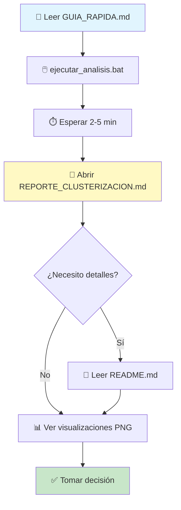

# 📋 ÍNDICE - Clusterización Simplificada

## 🎯 INICIO INMEDIATO

```bash
📂 Ubicación: C:\tecnoandina\f35_modelacion2\analisis\clusterizacion2\
🖱️ Ejecutar: ejecutar_analisis.bat (doble click)
⏱️ Duración: 2-5 minutos
📄 Ver: REPORTE_CLUSTERIZACION.md
```

---

## 📁 ESTRUCTURA DEL PROYECTO

### 📚 Documentación
```
├── README.md              # Documentación técnica completa
├── GUIA_RAPIDA.md        # Guía visual rápida
└── INDICE.md             # Este archivo - navegación
```

### 🐍 Scripts
```
├── analisis_clusterizacion_simplificado.py  # Script principal
└── ejecutar_analisis.bat                    # Ejecutable Windows
```

### 📦 Configuración
```
└── requirements.txt      # Dependencias Python
```

### 📊 Archivos Generados (al ejecutar)
```
├── 📈 VISUALIZACIONES
│   ├── comparacion_estrategias.png
│   ├── kmeans_metricas.png
│   ├── visualizacion_clusters.png
│   └── dendrograma.png
│
├── 📄 DATOS
│   ├── comparacion_estrategias.csv
│   ├── resultados_detallados.json
│   └── dataset_con_clusters.csv
│
└── 📝 REPORTE
    └── REPORTE_CLUSTERIZACION.md  ⭐ PRINCIPAL
```

---

## 🔑 ARCHIVOS CLAVE

### ⭐ Para Empezar
| Archivo | Descripción | Acción |
|---------|-------------|--------|
| `ejecutar_analisis.bat` | Ejecutable Windows | 🖱️ Doble click |
| `GUIA_RAPIDA.md` | Guía visual | 📖 Leer primero |

### 📖 Para Entender
| Archivo | Descripción | Cuándo usar |
|---------|-------------|-------------|
| `README.md` | Documentación completa | Detalles técnicos |
| `REPORTE_CLUSTERIZACION.md` | Resultados del análisis | Después de ejecutar |

### 🐍 Para Desarrollar
| Archivo | Descripción | Cuándo modificar |
|---------|-------------|------------------|
| `analisis_clusterizacion_simplificado.py` | Script principal | Cambiar parámetros |
| `requirements.txt` | Dependencias | Agregar librerías |

---

## 🚀 FLUJO DE TRABAJO RECOMENDADO



### Paso a Paso

1. **Preparación** (1 min)
   - Leer `GUIA_RAPIDA.md`
   - Verificar dataset disponible

2. **Ejecución** (2-5 min)
   - Doble click en `ejecutar_analisis.bat`
   - Esperar a que termine

3. **Análisis** (5-10 min)
   - Abrir `REPORTE_CLUSTERIZACION.md`
   - Revisar visualizaciones PNG
   - Leer tabla comparativa CSV

4. **Decisión** (variable)
   - Evaluar mejora porcentual
   - Considerar complejidad
   - Implementar o no clustering

---

## 📊 DESCRIPCIÓN DE ARCHIVOS GENERADOS

### 🖼️ Visualizaciones (PNG)

#### `comparacion_estrategias.png`
- **Contenido:** 4 gráficos de barras
  - MAE por estrategia
  - RMSE por estrategia
  - R² por estrategia
  - CV MAE por estrategia
- **Uso:** Comparación visual rápida
- **Formato:** PNG 1600x1200, 300 DPI

#### `kmeans_metricas.png`
- **Contenido:** 3 gráficos de línea
  - Elbow Curve (Inertia vs K)
  - Silhouette Score vs K
  - Davies-Bouldin Score vs K
- **Uso:** Determinar K óptimo
- **Formato:** PNG 1800x500, 300 DPI

#### `visualizacion_clusters.png`
- **Contenido:** 3 scatter plots PCA
  - K-Means clusters
  - Hierarchical clusters
  - Distribución por Sexo
- **Uso:** Visualizar separación de clusters
- **Formato:** PNG 2000x600, 300 DPI

#### `dendrograma.png`
- **Contenido:** Dendrograma jerárquico
- **Uso:** Visualizar estructura de clustering
- **Formato:** PNG 1600x800, 300 DPI

### 📄 Datos (CSV/JSON)

#### `comparacion_estrategias.csv`
- **Contenido:** Tabla comparativa
- **Columnas:**
  ```
  Estrategia, N_Modelos, MAE, RMSE, R², CV_MAE
  ```
- **Uso:** Análisis en Excel
- **Formato:** CSV con encabezados

#### `resultados_detallados.json`
- **Contenido:** Resultados completos
- **Estructura:**
  ```json
  {
    "fecha_analisis": "...",
    "variables_clustering": [...],
    "anova_results": {...},
    "k_optimo_silhouette": ...,
    "estrategias": [...],
    "mejor_estrategia": "...",
    "mejora_porcentual": ...,
    "recomendacion": "..."
  }
  ```
- **Uso:** Procesamiento programático
- **Formato:** JSON indentado

#### `dataset_con_clusters.csv`
- **Contenido:** Dataset original + clusters
- **Columnas añadidas:**
  - `cluster_kmeans`
  - `cluster_hierarchical`
  - `cluster_dbscan`
- **Uso:** Análisis posterior, validación
- **Formato:** CSV completo

### 📝 Reporte (Markdown)

#### `REPORTE_CLUSTERIZACION.md` ⭐
- **Contenido:**
  1. Resumen Ejecutivo
  2. Mejor Estrategia
  3. Tabla Comparativa
  4. Análisis Estadístico (ANOVA)
  5. Clustering Automático
  6. **Recomendación Final** ✅
  7. Archivos Generados
  8. Próximos Pasos
- **Uso:** Documento principal de decisión
- **Formato:** Markdown con tablas y emojis

---

## 🎯 GUÍAS POR OBJETIVO

### 🆕 Primera Vez - Nunca ejecuté el análisis
1. `GUIA_RAPIDA.md` → Entender qué hace
2. `ejecutar_analisis.bat` → Ejecutar
3. `REPORTE_CLUSTERIZACION.md` → Ver resultados

### 🔍 Investigación - Quiero entender a fondo
1. `README.md` → Documentación técnica
2. `analisis_clusterizacion_simplificado.py` → Ver código
3. `resultados_detallados.json` → Datos completos

### 🚀 Implementación - Voy a deployar
1. `REPORTE_CLUSTERIZACION.md` → Recomendación
2. `comparacion_estrategias.csv` → Métricas
3. `visualizacion_clusters.png` → Validar separación

### 🔧 Personalización - Quiero modificar
1. `README.md` → Sección "Personalización"
2. `analisis_clusterizacion_simplificado.py` → Editar parámetros
3. `ejecutar_analisis.bat` → Re-ejecutar

---

## 📖 CÓMO LEER LOS RESULTADOS

### 1️⃣ Reporte Ejecutivo
```
📄 REPORTE_CLUSTERIZACION.md
   └─ Sección 6: "Recomendación Final"
      ├─ ✅ Implementar
      ├─ ⚠️ Evaluar
      └─ ❌ Mantener único
```

### 2️⃣ Visualizaciones
```
📊 comparacion_estrategias.png
   └─ Ver barras más cortas (mejor MAE)

🔍 visualizacion_clusters.png
   └─ Clusters bien separados = bueno
```

### 3️⃣ Tabla Comparativa
```
📄 comparacion_estrategias.csv
   └─ Ordenado por MAE (menor es mejor)
```

---

## 🆚 DIFERENCIAS CON `clusterizacion` ORIGINAL

| Característica | Original | Simplificado |
|---------------|----------|--------------|
| **Carpeta** | `analisis/clusterizacion` | `analisis/clusterizacion2` |
| **Variables** | Todas (13+) | Solo 3 principales |
| **Estrategias** | 8 | 5 |
| **Incluye Sector** | ✅ Sí | ❌ No |
| **Tiempo ejecución** | 5-10 min | 2-5 min |
| **Archivos generados** | 8 | 8 |
| **Complejidad** | Alta | Media |
| **Enfoque** | Exhaustivo | Operacional |
| **Uso recomendado** | Investigación | Implementación |

### ¿Cuándo usar cada uno?

**Original (`clusterizacion`)** 🔬
- Análisis exploratorio completo
- Incluir sectores geográficos
- Tiempo no es limitante
- Quieres todas las opciones

**Simplificado (`clusterizacion2`)** ⚡
- Enfoque operacional
- Variables controlables
- Resultados rápidos
- Implementación práctica

---

## 🔧 PERSONALIZACIÓN RÁPIDA

### Cambiar Variables de Clustering
**Archivo:** `analisis_clusterizacion_simplificado.py`  
**Línea:** ~26

```python
# Original
variables_clustering = ['sexo', 'densidad_pollos_m2', 'tipoConstruccion']

# Agregar variable
variables_clustering = ['sexo', 'densidad_pollos_m2', 'tipoConstruccion', 'nueva_var']
```

### Cambiar Rango de K
**Archivo:** `analisis_clusterizacion_simplificado.py`  
**Línea:** ~135

```python
# Original
k_range = range(2, 11)

# Modificar
k_range = range(2, 8)  # Solo hasta K=7
```

### Cambiar Modelo
**Archivo:** `analisis_clusterizacion_simplificado.py`  
**Línea:** ~200

```python
# Original
modelo = RandomForestRegressor(n_estimators=100)

# Modificar
modelo = GradientBoostingRegressor(n_estimators=100)
```

---

## 🚨 SOLUCIÓN DE PROBLEMAS

### ❌ Error: Python no encontrado
```bash
# Windows
python --version

# Si falla, instalar Python 3.8+
# Agregar al PATH del sistema
```

### ❌ Error: Módulo no encontrado
```bash
pip install -r requirements.txt
```

### ❌ Error: Archivo CSV no encontrado
```bash
# Verificar ruta relativa
../../resumen_crianzas_para_modelo2.csv

# Debe existir:
C:\tecnoandina\f35_modelacion2\resumen_crianzas_para_modelo2.csv
```

### ❌ Error: Sin memoria
```bash
# Reducir n_estimators en línea ~200
RandomForestRegressor(n_estimators=50)
```

---

## 📝 CHECKLIST DE EJECUCIÓN

### ✅ Pre-ejecución
- [ ] Python 3.8+ instalado
- [ ] Dataset disponible
- [ ] Dependencias instaladas
- [ ] 100 MB espacio libre
- [ ] 5 minutos disponibles

### ✅ Post-ejecución
- [ ] 8 archivos generados
- [ ] Sin errores en consola
- [ ] Reporte creado
- [ ] Visualizaciones correctas

### ✅ Análisis
- [ ] Reporte leído
- [ ] Mejora verificada
- [ ] Visualizaciones revisadas
- [ ] Decisión tomada

---

## 🎓 APRENDIZAJE

### Conceptos Clave
1. **Clustering** - Agrupar datos similares
2. **ANOVA** - Detectar diferencias significativas
3. **Cross-Validation** - Validar generalización
4. **PCA** - Reducción dimensional para visualizar

### Métricas Importantes
- **MAE** - Error promedio absoluto
- **RMSE** - Error cuadrático medio
- **R²** - Varianza explicada
- **Silhouette** - Calidad de clustering

### Decisión Estratégica
```
Mejora > 5%  → Implementar
Mejora 1-5%  → Evaluar
Mejora < 1%  → Modelo único
```

---

## 📞 AYUDA RÁPIDA

### ❓ No sé por dónde empezar
→ Lee `GUIA_RAPIDA.md`

### ❓ Quiero detalles técnicos
→ Lee `README.md`

### ❓ Cómo ejecuto el análisis
→ Doble click `ejecutar_analisis.bat`

### ❓ Cómo leo los resultados
→ Abre `REPORTE_CLUSTERIZACION.md`

### ❓ Hay un error
→ Revisa sección "Solución de Problemas"

---

## 🚀 SIGUIENTE PASO

```bash
# 1. Navegar
cd C:\tecnoandina\f35_modelacion2\analisis\clusterizacion2

# 2. Ejecutar
ejecutar_analisis.bat

# 3. Esperar 2-5 minutos

# 4. Revisar
REPORTE_CLUSTERIZACION.md
```

**¡Listo!** 🎉

---

## 📚 ÍNDICE RÁPIDO DE SECCIONES

### En este archivo (INDICE.md)
- [Inicio Inmediato](#-inicio-inmediato)
- [Estructura del Proyecto](#-estructura-del-proyecto)
- [Archivos Clave](#-archivos-clave)
- [Flujo de Trabajo](#-flujo-de-trabajo-recomendado)
- [Descripción de Archivos](#-descripción-de-archivos-generados)
- [Guías por Objetivo](#-guías-por-objetivo)
- [Diferencias con Original](#-diferencias-con-clusterizacion-original)
- [Personalización](#-personalización-rápida)
- [Solución de Problemas](#-solución-de-problemas)

### En otros archivos
- **GUIA_RAPIDA.md** → Tutorial visual
- **README.md** → Documentación técnica
- **REPORTE_CLUSTERIZACION.md** → Resultados (después de ejecutar)

---

**Última actualización:** 2025-10-05  
**Versión:** 1.0  
**Proyecto:** F35 Modelación - Índice de Navegación
