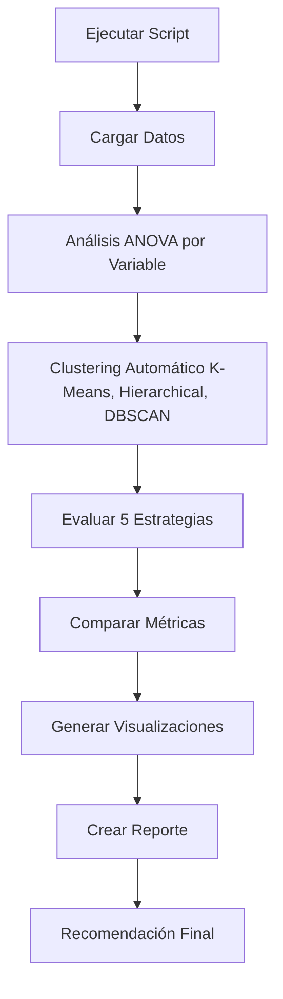

# 📊 Análisis de Clusterización Simplificado

## 📝 Descripción

Análisis enfocado en determinar si es conveniente crear **modelos separados** usando únicamente 3 variables clave:
- **Sexo** (HEMBRA/MACHO)
- **Densidad** (pollos/m²)
- **Tipo de Construcción** (Tradicional/Transversal/Black Out)

## 🎯 Diferencia con `clusterizacion` original

| Aspecto | Original | Simplificado |
|---------|----------|--------------|
| Variables clustering | Todas (13) | Solo 3 principales |
| Incluye Sector | ✅ Sí | ❌ No |
| Estrategias | 8 | 5 |
| Enfoque | Exhaustivo | Variables operacionales |
| Complejidad | Alta | Media |

## 🔬 Estrategias Evaluadas

1. **Modelo Único** (Baseline)
2. **Modelos por Sexo** (2 modelos)
3. **Modelos por Tipo de Construcción** (3 modelos)
4. **Modelos por K-Means Clustering** (K automático)
5. **Modelos por Hierarchical Clustering** (K automático)

## 🚀 Ejecución Rápida

### Opción 1: Un Click (Más Fácil) 🖱️
```
1. Navegar a: C:\tecnoandina\f35_modelacion2\analisis\clusterizacion2\
2. Doble click en: ejecutar_analisis.bat
3. Esperar 2-5 minutos
4. Revisar: REPORTE_CLUSTERIZACION.md
```

### Opción 2: Línea de Comandos 💻
```bash
cd C:\tecnoandina\f35_modelacion2\analisis\clusterizacion2
pip install -r requirements.txt
python analisis_clusterizacion_simplificado.py
```

### Opción 3: PyCharm/Jupyter 📓
```python
%run C:\tecnoandina\f35_modelacion2\analisis\clusterizacion2\analisis_clusterizacion_simplificado.py
```

## 📊 Resultados Generados

### 🖼️ Visualizaciones (4 archivos PNG)

1. **`comparacion_estrategias.png`**
   - 4 gráficos: MAE, RMSE, R², CV MAE
   - Comparación visual de todas las estrategias

2. **`kmeans_metricas.png`**
   - Elbow Curve (método del codo)
   - Silhouette Score vs K
   - Davies-Bouldin Score vs K

3. **`visualizacion_clusters.png`**
   - Proyección PCA de K-Means
   - Proyección PCA de Hierarchical
   - Distribución por Sexo

4. **`dendrograma.png`**
   - Clustering jerárquico
   - Últimas 30 fusiones

### 📄 Datos y Reportes (4 archivos)

1. **`comparacion_estrategias.csv`**
   - Tabla Excel comparativa
   - Todas las métricas

2. **`resultados_detallados.json`**
   - Resultados completos en JSON
   - Estructurado para procesamiento

3. **`dataset_con_clusters.csv`**
   - Dataset original + asignaciones de cluster

4. **`REPORTE_CLUSTERIZACION.md`** ⭐
   - Reporte ejecutivo
   - Recomendación final
   - Interpretación de resultados

## 📦 Requisitos

```bash
pandas>=1.3.0
numpy>=1.21.0
matplotlib>=3.4.0
seaborn>=0.11.0
scikit-learn>=1.0.0
scipy>=1.7.0
tabulate>=0.8.9
```

## 🔍 Variables de Clustering

### Variables Usadas (3)
- `sexo` (HEMBRA/MACHO)
- `densidad_pollos_m2` (numérica)
- `tipoConstruccion` (Tradicional/Transversal/Black Out)

### Variables Excluidas
- ❌ Sector (reducir complejidad)
- ❌ Otras variables temporales/geográficas

## 📈 Interpretación de Resultados

### Métricas Clave

**MAE (Mean Absolute Error)**
- Error promedio en gramos
- Menor es mejor
- Ejemplo: MAE=1.5 → error promedio de ±1.5 gramos

**RMSE (Root Mean Squared Error)**
- Penaliza errores grandes
- Menor es mejor

**R² (R-squared)**
- Porcentaje de varianza explicada
- Mayor es mejor (0-1)
- R²=0.90 → modelo explica 90% de la variabilidad

**CV MAE (Cross-Validation MAE)**
- MAE en validación cruzada (5 folds)
- Indica generalización
- Menor es mejor

### Criterios de Decisión

| Mejora vs Baseline | Recomendación |
|-------------------|---------------|
| > 5% | ✅ Implementar clusterización |
| 1-5% | ⚠️ Evaluar trade-off |
| < 1% | ❌ Mantener modelo único |

## 🎯 ¿Cuándo usar este análisis?

### ✅ Usar `clusterizacion2` cuando:
- Quieres enfoque en variables operacionales
- Simplicidad es prioridad
- No necesitas análisis por sector
- Quieres resultados rápidos (2-5 min vs 10 min)

### ✅ Usar `clusterizacion` original cuando:
- Necesitas análisis exhaustivo
- Quieres incluir sectores geográficos
- Tiempo de ejecución no es crítico
- Quieres explorar todas las posibilidades

## 📊 Análisis Estadístico

### ANOVA
Se realiza ANOVA (Analysis of Variance) para cada variable:
- **p-value < 0.05** → Diferencias significativas entre grupos
- **p-value ≥ 0.05** → No hay diferencias significativas

### Clustering Automático

**K-Means**
- Determina K óptimo usando Silhouette Score
- Evalúa K desde 2 hasta 10

**Hierarchical**
- Método Ward linkage
- Genera dendrograma

**DBSCAN**
- Basado en densidad
- Detecta outliers automáticamente

## 🔧 Personalización

### Cambiar rango de K
Editar línea ~135 del script:
```python
k_range = range(2, 11)  # Cambiar límites
```

### Cambiar parámetros DBSCAN
Línea ~160:
```python
dbscan = DBSCAN(eps=1.0, min_samples=10)
```

### Cambiar modelo de predicción
Línea ~200:
```python
modelo = RandomForestRegressor(n_estimators=100)
```

## 📝 Flujo de Trabajo



## 🎓 Interpretación del Reporte

### 1. Abrir `REPORTE_CLUSTERIZACION.md`

### 2. Ir a "Mejor Estrategia"
```markdown
🏆 MEJOR ESTRATEGIA: ...
```

### 3. Verificar mejora
```markdown
📈 Mejora vs Baseline: X.XX%
```

### 4. Leer recomendación
- ✅ = Implementar
- ⚠️ = Evaluar
- ❌ = Mantener único

### 5. Revisar visualizaciones
- `comparacion_estrategias.png` → Comparación
- `visualizacion_clusters.png` → Distribución

## ❓ Preguntas Frecuentes

**P: ¿Por qué solo 3 variables?**  
R: Enfoque en variables operacionales clave que el equipo puede controlar.

**P: ¿Cuánto tarda?**  
R: 2-5 minutos (vs 10 min del análisis completo).

**P: ¿Qué hago si hay error?**  
R: 
1. Verificar Python instalado
2. Instalar dependencias: `pip install -r requirements.txt`
3. Verificar ruta del dataset: `../../resumen_crianzas_para_modelo2.csv`

**P: ¿Cómo interpreto "mejora 2%"?**  
R: Si el baseline tiene MAE=1.5, una mejora del 2% da MAE=1.47 (0.03 gramos menos de error).

**P: ¿Puedo agregar más variables?**  
R: Sí, editar línea ~26:
```python
variables_clustering = ['sexo', 'densidad_pollos_m2', 'tipoConstruccion', 'nueva_variable']
```

## 🚀 Próximos Pasos

1. **Ejecutar el análisis**
   ```bash
   ejecutar_analisis.bat
   ```

2. **Revisar reporte**
   ```
   REPORTE_CLUSTERIZACION.md
   ```

3. **Tomar decisión**
   - Implementar clusterización
   - Mantener modelo único
   - Investigar más

4. **Actuar según recomendación**

## 📞 Soporte

Si encuentras errores:
1. Verificar instalación de Python
2. Revisar `requirements.txt`
3. Comprobar ruta del dataset
4. Verificar formato del CSV

## 📚 Archivos del Proyecto

```
clusterizacion2/
│
├── analisis_clusterizacion_simplificado.py  # Script principal
├── ejecutar_analisis.bat                    # Ejecutable Windows
├── requirements.txt                         # Dependencias
├── README.md                               # Esta documentación
│
└── (Generados al ejecutar)
    ├── comparacion_estrategias.png
    ├── kmeans_metricas.png
    ├── visualizacion_clusters.png
    ├── dendrograma.png
    ├── comparacion_estrategias.csv
    ├── resultados_detallados.json
    ├── dataset_con_clusters.csv
    └── REPORTE_CLUSTERIZACION.md
```

---

**¡Listo para ejecutar!** 🚀

```bash
cd C:\tecnoandina\f35_modelacion2\analisis\clusterizacion2
ejecutar_analisis.bat
```

**Última actualización:** 2025-10-05  
**Versión:** 1.0  
**Proyecto:** F35 Modelación - Análisis Simplificado
