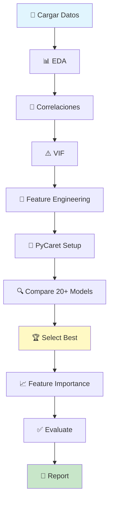

# 🚀 GUÍA RÁPIDA - Modelo 01 con PyCaret

## ⚡ INICIO EN 1 MINUTO

```bash
1. 📂 Ir a: C:\tecnoandina\f35_modelacion2\analisis\modelo01\
2. 🖱️ Doble click: ejecutar_analisis.bat
3. ⏱️ Esperar: 10-20 minutos (tomar un café ☕)
4. 📄 Abrir: REPORTE_ANALISIS.md
```

---

## 🎯 ¿QUÉ HACE ESTE ANÁLISIS?

### Crea el **MEJOR modelo predictivo** para `ganancia_promedio_gramos`

**Usando:**
- ✅ **PyCaret** - Compara 20+ algoritmos automáticamente
- ✅ **Feature Engineering** - Variables cíclicas, ratios, categorías
- ✅ **Análisis VIF** - Detecta y elimina multicolinealidad
- ✅ **8 Visualizaciones** - Análisis completo y detallado

---

## 📊 VARIABLES ANALIZADAS

### 7 Variables de Entrada

| Variable | Tipo | ¿Normalizar? | Tratamiento |
|----------|------|--------------|-------------|
| `mes_carga` | Numérica (1-12) | ✅ | → sin/cos (cíclica) |
| `edad_madres_dias` | Numérica | ✅ | StandardScaler |
| `peso_inicial_gramos` | Numérica | ✅ | StandardScaler |
| `sexo` | Categórica | ❌ | One-Hot Encoding |
| `kilos_recibidos_percapita` | Numérica | ✅ | StandardScaler |
| `tipoConstruccion` | Categórica | ❌ | One-Hot Encoding |
| `densidad_pollos_m2` | Numérica | ✅ | StandardScaler |

### ¿Por qué normalizar?

```
SIN normalización:
  peso_inicial: 40-50 gramos
  densidad: 10-18 pollos/m²
  edad_madres: 200-400 días
  
  ❌ El modelo da más peso a números grandes
```

```
CON normalización:
  Todas las variables: 0-1 o -1 a 1
  
  ✅ El modelo considera todas por igual
```

---

## 🔬 ANÁLISIS REALIZADOS

### 1. **EDA (Exploratory Data Analysis)** 📊
- Estadísticas descriptivas
- Distribuciones de variables
- Detección de outliers (IQR method)
- ANOVA para categóricas

### 2. **Correlaciones** 🔗
- Matriz completa de correlaciones
- Top correlaciones con target
- Identificación de correlaciones altas (>0.7)

### 3. **Multicolinealidad (VIF)** ⚠️
```
VIF < 5   → ✅ OK
VIF 5-10  → ⚠️ Moderada
VIF > 10  → 🔴 Severa (eliminar)
```

### 4. **Feature Engineering** 🔧

#### Variables Cíclicas (para mes)
```python
mes_sin = sin(2π × mes / 12)
mes_cos = cos(2π × mes / 12)
```
**¿Por qué?** Mes 1 y mes 12 son consecutivos, no extremos

#### Ratios
```python
alimento_por_densidad = kilos_recibidos / densidad
peso_inicial_por_densidad = peso_inicial / densidad
```
**¿Por qué?** Captura interacciones entre variables

#### Categorías
- `edad_madres_categoria`: Joven/Adulta/Madura/Vieja
- `densidad_categoria`: Baja/Media/Alta/Muy Alta

### 5. **Modelamiento con PyCaret** 🤖

**Modelos comparados automáticamente:**
- Linear Regression
- Ridge, Lasso, Elastic Net
- Random Forest ⭐
- Gradient Boosting ⭐
- XGBoost ⭐
- LightGBM ⭐
- CatBoost
- Extra Trees
- AdaBoost
- **...y más**

**PyCaret selecciona el mejor según MAE**

---

## 📈 MÉTRICAS EXPLICADAS

### MAE (Mean Absolute Error) 📏
```
MAE = Promedio(|Real - Predicción|)
```
- Error promedio en gramos
- **Menor = Mejor**
- Ejemplo: MAE=2.5 → error de ±2.5g

### RMSE (Root Mean Squared Error) 📐
```
RMSE = √(Promedio((Real - Pred)²))
```
- Penaliza errores grandes
- **Menor = Mejor**
- Siempre ≥ MAE

### R² (R-squared) 🎯
```
R² = 1 - (Var residual / Var total)
```
- % de varianza explicada
- **Mayor = Mejor** (0-1)
- R²=0.85 → modelo explica 85%

---

## 📁 ARCHIVOS QUE SE GENERAN

### 🖼️ Visualizaciones (8 PNG)

1. **01_matriz_correlacion.png**
   - Heatmap de todas las correlaciones
   - Identifica relaciones entre variables

2. **02_distribuciones.png**
   - Histogramas de variables numéricas
   - Detección de asimetría

3. **03_target_por_categoricas.png**
   - Boxplots por sexo y tipo construcción
   - Visualiza diferencias entre grupos

4. **04_top_correlaciones.png**
   - Top 5 correlaciones con target
   - Scatter plots + línea de regresión

5. **05_vif_analysis.png**
   - VIF de cada variable
   - Identifica multicolinealidad

6. **06_feature_importance.png** ⭐
   - Top 15 features más importantes
   - Del mejor modelo

7. **07_predicciones_vs_real.png** ⭐
   - Predicciones vs valores reales
   - Métricas: MAE, RMSE, R²

8. **08_analisis_residuos.png**
   - Residuos vs predicciones
   - Histograma de residuos

### 📄 Datos (3 archivos)

- `resultados_analisis.json` - Todo en JSON
- `feature_importance.csv` - Tabla de importancia
- `modelo_final.pkl` - Modelo entrenado

### 📝 Reporte

- `REPORTE_ANALISIS.md` - **Reporte ejecutivo completo** ⭐

---

## 🔍 FEATURE ENGINEERING EXPLICADO

### 1. ¿Por qué mes cíclico?

**❌ Tratamiento incorrecto:**
```
Enero = 1
Febrero = 2
...
Diciembre = 12

Problema: Modelo piensa que Dic (12) y Ene (1) 
están muy lejos, pero son consecutivos!
```

**✅ Tratamiento correcto:**
```python
mes_sin = sin(2π × mes / 12)
mes_cos = cos(2π × mes / 12)

Diciembre y Enero ahora están cerca en el espacio sin/cos
```

### 2. ¿Por qué ratios?

**Capturan interacciones:**

```python
# En vez de:
kilos_recibidos = 3.5 kg
densidad = 15 pollos/m²

# Modelo ve:
alimento_efectivo = 3.5 / 15 = 0.233 kg/pollo/m²

¡Más información con menos variables!
```

---

## 🎨 FLUJO DEL ANÁLISIS



---

## 💡 RECOMENDACIONES DE FEATURES

### ✅ Mantener si:
- Correlación con target > 0.3
- VIF < 10
- Alta importancia en modelo

### ❌ Eliminar si:
- Correlación con target < 0.1
- VIF > 10 (y redundante)
- Baja importancia en modelo

**El script decide automáticamente** 🎯

---

## 🆚 COMPARACIÓN CON OTROS ANÁLISIS

| Característica | clusterizacion | clusterizacion2 | **modelo01** |
|---------------|----------------|-----------------|--------------|
| **Objetivo** | Agrupar | Agrupar (simple) | **Predecir** |
| **Estrategias** | 8 | 5 | 20+ algoritmos |
| **Feature Eng.** | Básico | Básico | **Avanzado** |
| **Multicolinealidad** | No | No | **✅ VIF** |
| **AutoML** | No | No | **✅ PyCaret** |
| **Tiempo** | 5-10 min | 2-5 min | **10-20 min** |
| **Output** | Clusters | Clusters | **Modelo + Importancia** |

---

## 🚨 SOLUCIÓN DE PROBLEMAS

### Error: PyCaret no instala

**Solución 1:**
```bash
python -m pip install --upgrade pip
pip install pycaret
```

**Solución 2:**
```bash
pip install pycaret==3.0.4
```

**Solución 3:**
```bash
conda install -c conda-forge pycaret
```

### Error: Tarda mucho

✅ **Normal**
- PyCaret prueba 20+ modelos
- Optimiza hiperparámetros
- Primera ejecución: 10-20 min

⚡ **Acelerar:**
```python
# En el script, cambiar:
best_models = compare_models(n_select=3)  # Solo top 3
```

### Error: Memoria insuficiente

```python
# Reducir complejidad:
best_models = compare_models(
    include=['lr', 'rf', 'gbr']  # Solo 3 modelos
)
```

---

## 📖 CÓMO LEER EL REPORTE

### 1. Abrir `REPORTE_ANALISIS.md`

### 2. Sección "Resumen Ejecutivo"
```markdown
Dataset:
- Filas: X
- Features: Y
```

### 3. Sección "Correlaciones"
```markdown
Top 5 correlaciones con target:
- peso_inicial: 0.85  ← Alta!
- kilos_recibidos: 0.72
- ...
```

### 4. Sección "VIF"
```markdown
| Feature | VIF | Interpretación |
|---------|-----|----------------|
| peso_inicial | 3.2 | 🟢 OK |
| kilos_recibidos | 12.5 | 🔴 Severa |
```

### 5. Sección "Modelo Final" ⭐
```markdown
🏆 Mejor Modelo: Random Forest

Métricas:
- MAE: 2.34 gramos
- RMSE: 3.12 gramos  
- R²: 0.89 (89% explicado)
```

### 6. Sección "Feature Importance"
```markdown
Top features:
1. peso_inicial_gramos
2. kilos_recibidos_percapita
3. mes_sin
...
```

---

## 🎯 CASOS DE USO

### Caso 1: Primera Vez 🆕
```
Objetivo: Entender qué variables importan
Acción: 
  1. Ejecutar análisis completo
  2. Revisar REPORTE_ANALISIS.md
  3. Ver 06_feature_importance.png
```

### Caso 2: Optimizar Modelo 🔧
```
Objetivo: Mejorar predicciones
Acción:
  1. Revisar VIF → eliminar redundantes
  2. Ver feature_importance → eliminar irrelevantes
  3. Re-ejecutar con menos features
```

### Caso 3: Deployment 🚀
```
Objetivo: Llevar a producción
Acción:
  1. Usar modelo_final.pkl
  2. Implementar pipeline de preprocessing
  3. Monitorear MAE en producción
```

---

## 📝 CHECKLIST DE EJECUCIÓN

### ✅ Pre-ejecución
- [ ] Python 3.8+ instalado
- [ ] Dataset disponible
- [ ] Espacio en disco: 200 MB
- [ ] Tiempo disponible: 20 minutos
- [ ] PyCaret instalado (o se instala automático)

### ✅ Durante ejecución
- [ ] Esperar pacientemente (10-20 min)
- [ ] No interrumpir el proceso
- [ ] Observar logs en consola

### ✅ Post-ejecución
- [ ] 11 archivos generados
- [ ] Sin errores en consola
- [ ] REPORTE_ANALISIS.md creado
- [ ] modelo_final.pkl existe

---

## 🎓 APRENDIZAJE CLAVE

### Conceptos Importantes

1. **Normalización** 
   - Iguala escalas de variables
   - Mejora convergencia de modelos

2. **Variables Cíclicas**
   - Para datos temporales (mes, día, hora)
   - sin/cos captura ciclicidad

3. **VIF (Multicolinealidad)**
   - Detecta variables redundantes
   - VIF > 10 = problema

4. **Feature Importance**
   - Muestra qué variables importan
   - Ayuda a simplificar modelo

5. **AutoML (PyCaret)**
   - Prueba múltiples modelos
   - Selecciona el mejor
   - Ahorra tiempo

---

## 🚀 SIGUIENTE PASO

```bash
# 1. Navegar
cd C:\tecnoandina\f35_modelacion2\analisis\modelo01

# 2. Ejecutar
ejecutar_analisis.bat

# 3. Esperar 10-20 minutos ☕

# 4. Revisar
REPORTE_ANALISIS.md
```

**¡Todo automatizado!** 🎉

---

## 📞 AYUDA RÁPIDA

| Pregunta | Respuesta |
|----------|-----------|
| ¿Cuánto tarda? | 10-20 minutos |
| ¿Necesito conocimientos de ML? | No, todo automático |
| ¿Qué archivo revisar primero? | REPORTE_ANALISIS.md |
| ¿Cómo sé si el modelo es bueno? | R² > 0.8 es excelente |
| ¿Dónde está el modelo final? | modelo_final.pkl |

---

**¡Listo para crear el mejor modelo!** 🏆

**Duración:** 10-20 minutos  
**Dificultad:** Fácil (un solo click)  
**Output:** Análisis exhaustivo + Modelo optimizado

---

**Última actualización:** 2025-10-05  
**Versión:** 1.0  
**Proyecto:** F35 Modelación - Guía Rápida Modelo 01
