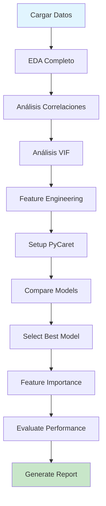

# 📊 Modelo 01 - Análisis y Modelamiento Exhaustivo con PyCaret

## 📝 Descripción

Sistema completo de análisis y modelamiento para predecir `ganancia_promedio_gramos` usando **PyCaret** y técnicas avanzadas de Machine Learning.

## 🎯 Objetivo

Crear el **mejor modelo predictivo posible** mediante:
- ✅ Análisis exploratorio exhaustivo (EDA)
- ✅ Feature engineering avanzado
- ✅ Detección de multicolinealidad (VIF)
- ✅ Comparación automática de múltiples modelos (PyCaret)
- ✅ Selección inteligente de features
- ✅ Interpretabilidad del modelo

## 📊 Variables Analizadas

### Variables de Entrada (Features)

| Variable | Tipo | Descripción | Normalización |
|----------|------|-------------|---------------|
| `mes_carga` | Numérica | Mes de carga (1-12) | ✅ Conversión cíclica (sin/cos) |
| `edad_madres_dias` | Numérica | Edad de las madres en días | ✅ StandardScaler |
| `peso_inicial_gramos` | Numérica | Peso inicial de los pollos | ✅ StandardScaler |
| `sexo` | Categórica | HEMBRA / MACHO | ✅ One-Hot Encoding |
| `kilos_recibidos_percapita` | Numérica | Alimento recibido por pollo | ✅ StandardScaler |
| `tipoConstruccion` | Categórica | Tradicional/Transversal/Black Out | ✅ One-Hot Encoding |
| `densidad_pollos_m2` | Numérica | Densidad de pollos por m² | ✅ StandardScaler |

### Variable Objetivo (Target)
- `ganancia_promedio_gramos`: Ganancia de peso en gramos

## 🔬 Análisis Realizados

### 1. **Análisis Exploratorio (EDA)**
- Estadísticas descriptivas completas
- Análisis de distribuciones
- Detección de outliers (método IQR)
- ANOVA para variables categóricas

### 2. **Análisis de Correlaciones**
- Matriz de correlación completa
- Identificación de correlaciones altas (>0.7)
- Top features correlacionados con target

### 3. **Análisis de Multicolinealidad (VIF)**
- Cálculo de Variance Inflation Factor
- Detección de features redundantes
- Recomendaciones de eliminación

### 4. **Feature Engineering**

#### Variables Cíclicas
```python
mes_sin = sin(2π * mes_carga / 12)
mes_cos = cos(2π * mes_carga / 12)
```

#### Ratios y Derivadas
```python
alimento_por_densidad = kilos_recibidos_percapita / densidad_pollos_m2
peso_inicial_por_densidad = peso_inicial_gramos / densidad_pollos_m2
```

#### Categorizaciones
- `edad_madres_categoria`: Joven/Adulta/Madura/Vieja
- `densidad_categoria`: Baja/Media/Alta/Muy Alta

### 5. **Modelamiento con PyCaret**

PyCaret compara automáticamente:
- Linear Regression
- Ridge Regression
- Lasso Regression
- Elastic Net
- Random Forest
- Gradient Boosting
- XGBoost
- LightGBM
- CatBoost
- Extra Trees
- AdaBoost
- Y más...

**Configuración PyCaret:**
```python
setup(
    normalize=True,           # Normalización automática
    transformation=True,      # Transformación de variables
    remove_outliers=True,     # Eliminar outliers
    outliers_threshold=0.05,  # 5% de outliers
    train_size=0.8,          # 80% train, 20% test
    fold=5                   # 5-fold cross-validation
)
```

## 🚀 Ejecución

### Opción 1: Un Click (Más Fácil) 🖱️
```
1. Navegar a: C:\tecnoandina\f35_modelacion2\analisis\modelo01\
2. Doble click: ejecutar_analisis.bat
3. Esperar: 10-20 minutos
4. Revisar: REPORTE_ANALISIS.md
```

### Opción 2: Línea de Comandos 💻
```bash
cd C:\tecnoandina\f35_modelacion2\analisis\modelo01
pip install -r requirements.txt
python analisis_modelamiento_pycaret.py
```

### Opción 3: PyCharm/Jupyter 📓
```python
%run C:\tecnoandina\f35_modelacion2\analisis\modelo01\analisis_modelamiento_pycaret.py
```

## 📦 Requisitos

### Python
- Python 3.8 o superior

### Librerías
```bash
# Core ML
pandas>=1.3.0
numpy>=1.21.0
scikit-learn>=1.0.0

# AutoML
pycaret>=3.0.0

# Visualización
matplotlib>=3.4.0
seaborn>=0.11.0

# Estadística
scipy>=1.7.0
statsmodels>=0.13.0
```

**Instalación:**
```bash
pip install -r requirements.txt
```

## 📊 Archivos Generados

### 🖼️ Visualizaciones (8 PNG)

1. **`01_matriz_correlacion.png`**
   - Heatmap de correlaciones
   - Identifica relaciones entre variables

2. **`02_distribuciones.png`**
   - Histogramas de todas las variables numéricas
   - Detección de asimetría y normalidad

3. **`03_target_por_categoricas.png`**
   - Boxplots del target por cada variable categórica
   - Visualiza diferencias entre grupos

4. **`04_top_correlaciones.png`**
   - Scatter plots de top 5 correlaciones con target
   - Incluye líneas de regresión

5. **`05_vif_analysis.png`**
   - Gráfico de barras del VIF
   - Identifica multicolinealidad

6. **`06_feature_importance.png`**
   - Top 15 features más importantes
   - Del mejor modelo de PyCaret

7. **`07_predicciones_vs_real.png`**
   - Scatter plot de predicciones vs valores reales
   - Línea de predicción perfecta
   - Métricas: MAE, RMSE, R²

8. **`08_analisis_residuos.png`**
   - Residuos vs predicciones
   - Histograma de residuos
   - Verifica supuestos del modelo

### 📄 Datos y Modelos

1. **`resultados_analisis.json`**
   - Resultados completos en formato JSON
   - Correlaciones, VIF, outliers, métricas

2. **`feature_importance.csv`**
   - Tabla de importancia de features
   - Ordenada de mayor a menor

3. **`modelo_final.pkl`**
   - Modelo entrenado guardado
   - Listo para deployment

### 📝 Reportes

1. **`REPORTE_ANALISIS.md`** ⭐
   - Reporte ejecutivo completo
   - Resumen de hallazgos
   - Recomendaciones
   - **Revisar este primero**

## 📈 Interpretación de Resultados

### Métricas del Modelo

**MAE (Mean Absolute Error)**
- Error promedio en gramos
- **Menor es mejor**
- Ejemplo: MAE=2.5 → error de ±2.5g

**RMSE (Root Mean Squared Error)**
- Penaliza errores grandes
- **Menor es mejor**
- Siempre ≥ MAE

**R² (R-squared)**
- % de varianza explicada
- **Mayor es mejor** (0-1)
- R²=0.85 → modelo explica 85%

### VIF (Variance Inflation Factor)

| VIF | Interpretación |
|-----|---------------|
| < 5 | ✅ No hay multicolinealidad |
| 5-10 | ⚠️ Multicolinealidad moderada |
| > 10 | 🔴 Multicolinealidad severa |

## 🔍 Análisis de Variables

### Características Entendidas

#### 1. **mes_carga** (1-12)
- **Tipo:** Temporal/Cíclica
- **Efecto:** Estacional (temperatura, humedad)
- **Tratamiento:** Convertida a sin/cos para capturar ciclicidad
- **Normalización:** No directa, pero sí en componentes cíclicas

#### 2. **edad_madres_dias**
- **Tipo:** Numérica continua
- **Efecto:** Calidad del huevo → desarrollo del pollo
- **Distribución:** Posiblemente normal
- **Normalización:** ✅ Sí (StandardScaler)

#### 3. **peso_inicial_gramos**
- **Tipo:** Numérica continua
- **Efecto:** **Predictor clave** del peso final
- **Correlación esperada:** Alta con target
- **Normalización:** ✅ Sí (StandardScaler)

#### 4. **sexo** (HEMBRA/MACHO)
- **Tipo:** Categórica binaria
- **Efecto:** Diferencias significativas (ANOVA confirmado)
- **Tratamiento:** One-Hot o Label Encoding
- **Normalización:** No aplica (categórica)

#### 5. **kilos_recibidos_percapita**
- **Tipo:** Numérica continua
- **Efecto:** **Variable crítica** (alimentación)
- **Correlación esperada:** Muy alta con ganancia
- **Normalización:** ✅ Sí (StandardScaler)

#### 6. **tipoConstruccion**
- **Tipo:** Categórica (3 valores)
- **Efecto:** Ambiente, temperatura, ventilación
- **Diferencias:** Significativas (ANOVA confirmado)
- **Tratamiento:** One-Hot Encoding
- **Normalización:** No aplica (categórica)

#### 7. **densidad_pollos_m2**
- **Tipo:** Numérica continua
- **Efecto:** Espacio vital, estrés, competencia
- **Relación:** Inversa con ganancia (más densidad → menos espacio)
- **Normalización:** ✅ Sí (StandardScaler)

### ⚠️ Consideraciones Importantes

#### Multicolinealidad Potencial
- `peso_inicial_gramos` y `kilos_recibidos_percapita` pueden correlacionar
- Solución: Análisis VIF identifica y recomienda eliminación

#### Feature Engineering Necesario
- **Mes cíclico:** sin(2π*mes/12) y cos(2π*mes/12)
  - Razón: Mes 1 y mes 12 son consecutivos, no extremos
- **Ratios:** kilos/densidad, peso_inicial/densidad
  - Razón: Capturar interacciones entre variables

#### Outliers
- Pollos con pesos extremos
- Densidades muy altas o muy bajas
- PyCaret los detecta y elimina automáticamente (threshold=5%)

## 🎯 Selección de Features

El análisis determina automáticamente:

### ✅ Features a Mantener
- Alta correlación con target (>0.3)
- VIF bajo (<10)
- Alta importancia en el modelo

### ❌ Features a Descartar
- Correlación baja con target (<0.1)
- VIF muy alto (>10) y redundantes
- Baja importancia en el modelo

### Proceso Automático
1. **Análisis de correlación** → Elimina irrelevantes
2. **Análisis VIF** → Elimina redundantes
3. **Feature Importance** → Confirma selección
4. **Recursive Feature Elimination** (si necesario)

## 💡 Ventajas de este Enfoque

### ✅ PyCaret
- Compara **20+ algoritmos** automáticamente
- Optimización de hiperparámetros incluida
- Pipeline completo de preprocessing
- Rápido y eficiente

### ✅ Feature Engineering
- Variables cíclicas para capturar estacionalidad
- Ratios para capturar interacciones
- Categorías para segmentación

### ✅ Validación Rigurosa
- Cross-validation 5-fold
- Train/test split 80/20
- Análisis de residuos
- Feature importance

## 📝 Flujo de Trabajo



## 🚨 Troubleshooting

### Error: PyCaret no instala
```bash
# Actualizar pip
python -m pip install --upgrade pip

# Instalar PyCaret
pip install pycaret

# Si falla, instalar versión específica
pip install pycaret==3.0.4
```

### Error: Memoria insuficiente
```python
# Reducir compare_models
best_models = compare_models(n_select=3)  # Solo top 3

# O usar un algoritmo específico
from pycaret.regression import create_model
model = create_model('rf')  # Solo Random Forest
```

### Error: Largo tiempo de ejecución
- Normal: 10-20 minutos primera vez
- PyCaret prueba múltiples modelos
- Usar GPU si está disponible

## ❓ Preguntas Frecuentes

**P: ¿Por qué normalizar variables numéricas?**  
R: Diferentes escalas (gramos, días, m²) afectan algoritmos como SVM, KNN. La normalización asegura que todas las variables contribuyan equitativamente.

**P: ¿Por qué convertir mes a sin/cos?**  
R: Mes 12 y mes 1 son consecutivos, no extremos. Sin/cos captura esta ciclicidad correctamente.

**P: ¿Qué modelo es mejor?**  
R: PyCaret prueba todos y selecciona el mejor según MAE. Usualmente Random Forest, Gradient Boosting o LightGBM.

**P: ¿Cuándo reentrenar?**  
R: Cada 1-3 meses o cuando MAE se degrade >10% en producción.

**P: ¿Cómo usar el modelo guardado?**  
R:
```python
from pycaret.regression import load_model, predict_model

modelo = load_model('modelo_final')
predicciones = predict_model(modelo, data=nuevos_datos)
```

## 📚 Referencias

- [PyCaret Documentation](https://pycaret.gitbook.io/)
- [Feature Engineering Guide](https://www.kaggle.com/learn/feature-engineering)
- [Multicollinearity (VIF)](https://www.statsmodels.org/stable/generated/statsmodels.stats.outliers_influence.variance_inflation_factor.html)

## 🎯 Próximos Pasos

1. **Ejecutar el análisis**
   ```bash
   ejecutar_analisis.bat
   ```

2. **Revisar reporte**
   ```
   REPORTE_ANALISIS.md
   ```

3. **Analizar feature importance**
   ```
   feature_importance.csv
   06_feature_importance.png
   ```

4. **Validar modelo**
   - Comparar con baseline
   - Evaluar en datos nuevos

5. **Deployment**
   - Integrar modelo_final.pkl
   - Configurar pipeline de predicción
   - Monitorear performance

---

**¡Listo para ejecutar!** 🚀

```bash
cd C:\tecnoandina\f35_modelacion2\analisis\modelo01
ejecutar_analisis.bat
```

**Duración estimada:** 10-20 minutos  
**Output:** 11 archivos de análisis completo

---

**Última actualización:** 2025-10-05  
**Versión:** 1.0  
**Proyecto:** F35 Modelación - Modelo 01 con PyCaret
