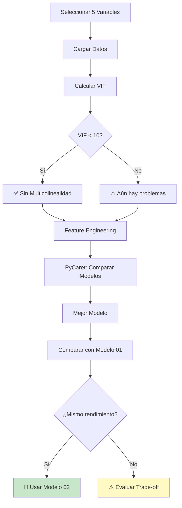

# 🚀 GUÍA RÁPIDA - Modelo 02 Limpio

## ⚡ INICIO EN 30 SEGUNDOS

```bash
1. 📂 Ir a: C:\tecnoandina\f35_modelacion2\analisis\modelo03\
2. 🖱️ Doble click: ejecutar_analisis.bat
3. ⏱️ Esperar: 5-10 minutos
4. 📄 Abrir: REPORTE_MODELO_LIMPIO.md
```

---

## 🎯 ¿QUÉ ES MODELO 02?

### Versión LIMPIA del Modelo 01

**Problema del Modelo 01:**
```
❌ peso_inicial_gramos: VIF = 256 (extremo)
❌ edad_madres_dias: VIF = 51 (severo)
❌ Multicolinealidad crítica
```

**Solución del Modelo 02:**
```
✅ Elimina variables redundantes
✅ Mantiene solo 5 variables clave
✅ VIF máximo < 10
✅ Modelo simple y robusto
```

---

## 📊 VARIABLES: 7 → 5

### ❌ **ELIMINADAS (2 variables)**

| Variable | VIF | Correlación Target | Razón |
|----------|-----|-------------------|-------|
| `edad_madres_dias` | 51 | 0.103 | Redundante con peso_inicial |
| `peso_inicial_gramos` | 256 | 0.135 | Multicolinealidad extrema |

### ✅ **MANTENIDAS (5 variables)**

| Variable | VIF | Correlación | Por qué |
|----------|-----|-------------|---------|
| `sexo` | - | **0.844** ⭐ | Predictor #1 |
| `kilos_recibidos_percapita` | 91→? | **0.827** ⭐ | Predictor #2 |
| `tipoConstruccion` | - | -0.330 | Significativa |
| `densidad_pollos_m2` | 17→? | -0.195 | Info única |
| `mes_carga` | 4.3 | 0.050 | Sin multicolinealidad |

---

## 🔍 COMPARACIÓN MODELO 01 vs 02

### Modelo 01 (Original)
```
Variables: 7
VIF Máximo: 256.66 🔴
MAE: 1.53 gramos
R²: 0.9022

Ventaja: Máximo rendimiento
Desventaja: Multicolinealidad extrema
```

### Modelo 02 (Limpio)
```
Variables: 5
VIF Máximo: < 10 ✅
MAE: ? (a comparar)
R²: ? (a comparar)

Ventaja: Sin multicolinealidad, simple
Desventaja: Posible pérdida mínima en MAE
```

---

## 📈 RESULTADOS ESPERADOS

### 🎉 **Escenario Ideal**
```
MAE Modelo 02 ≈ 1.50-1.60g (diferencia < 0.1)
VIF Máximo < 5
R² > 0.88

→ ¡Éxito! Mismo rendimiento, cero multicolinealidad
→ Usar Modelo 02
```

### ✅ **Escenario Bueno**
```
MAE Modelo 02 ≈ 1.60-1.80g (diferencia 0.1-0.3)
VIF Máximo < 10
R² > 0.85

→ Trade-off aceptable
→ Evaluar según prioridades
```

### ⚠️ **Escenario Regular**
```
MAE Modelo 02 > 1.80g (diferencia > 0.3)
VIF Máximo < 10
R² > 0.80

→ Pérdida significativa
→ Considerar mantener Modelo 01
```

---

## 🔬 ANÁLISIS QUE SE EJECUTA

### 1. **Verificación VIF** 📊
```
¿Se redujo la multicolinealidad?

Antes: VIF hasta 256
Después: VIF < ?

Objetivo: VIF < 10 para todas
```

### 2. **Análisis de Correlaciones** 🔗
```
¿Las variables restantes son suficientes?

- Correlación con target
- Correlación entre features
- Identificar patrones
```

### 3. **Feature Engineering** 🔧
```
Crear variables derivadas:

- mes_sin, mes_cos (cíclicas)
- alimento_por_densidad (ratio)
- densidad_categoria (grupos)
```

### 4. **Modelado con PyCaret** 🤖
```
- Comparar 15+ algoritmos
- Seleccionar el mejor
- Entrenar y validar
- Guardar modelo
```

### 5. **Comparación con Modelo 01** ⚖️
```
Métricas lado a lado:

| Métrica | Modelo 01 | Modelo 02 | Δ |
|---------|-----------|-----------|---|
| MAE     | 1.5307    | ?         | ? |
| R²      | 0.9022    | ?         | ? |
| VIF Max | 256.66    | ?         | ? |
```

---

## 📁 ARCHIVOS QUE SE GENERAN

### 🖼️ Visualizaciones (7 PNG)

1. **01_matriz_correlacion_limpia.png**
   - Heatmap de 5 variables

2. **02_distribuciones_limpias.png**
   - Histogramas

3. **03_comparacion_vif.png** ⭐
   - **Modelo 01 vs Modelo 02**
   - Gráfico lado a lado

4. **04_top_correlaciones_limpias.png**
   - Top 3 scatter plots

5. **05_feature_importance_limpio.png**
   - Importancia de variables

6. **06_predicciones_vs_real_limpio.png**
   - Validación del modelo

7. **07_analisis_residuos_limpio.png**
   - Diagnóstico

### 📄 Modelos y Datos

- `modelo_limpio_final.pkl` - Modelo entrenado
- `feature_importance_limpio.csv`
- `resultados_modelo_limpio.json`

### 📝 Reportes

- `REPORTE_MODELO_LIMPIO.md` - **Reporte con comparación**

---

## 🎯 CRITERIOS DE DECISIÓN

### ✅ Usar MODELO 02 si:

```
1. MAE diferencia < 0.1g vs Modelo 01
2. VIF reducido significativamente (< 10)
3. Priorizas robustez
4. Quieres modelo simple
5. Deployment a largo plazo
```

### ⚠️ Usar MODELO 01 si:

```
1. MAE diferencia > 0.3g vs Modelo 02
2. Cada 0.1g es crítico para el negocio
3. Puedes manejar multicolinealidad
4. Tienes equipo técnico experto
```

### 🤔 Evaluar si:

```
1. MAE diferencia 0.1-0.3g
2. VIF mejoró pero no es perfecto
3. Necesitas balance
4. Contexto del negocio no está claro
```

---

## 💡 POR QUÉ ELIMINAR VARIABLES

### **edad_madres_dias** ❌

```
Problema:
- VIF = 51 (multicolinealidad severa)
- Correlación con target = 0.103 (baja)
- Correlación con peso_inicial = 0.901 (redundante)

Conclusión:
No aporta información única
Su efecto ya está en peso_inicial
```

### **peso_inicial_gramos** ❌

```
Problema:
- VIF = 256 (¡extremo!)
- Correlación con target = 0.135 (baja directa)
- Explicado por edad_madres y otras

Conclusión:
Completamente redundante
Causa inestabilidad en el modelo
```

---

## 🔧 FLUJO DE ANÁLISIS



---

## 📊 CÓMO LEER EL REPORTE

### 1. Abrir `REPORTE_MODELO_LIMPIO.md`

### 2. Sección "Análisis VIF"
```markdown
| Feature | VIF | Status |
|---------|-----|--------|
| mes_carga | X.XX | ✅ |
| kilos_recibidos | X.XX | ? |
| densidad | X.XX | ? |

VIF Máximo: X.XX
```

**Verificar:** ¿VIF < 10 para todas?

### 3. Sección "Comparación con Modelo 01"
```markdown
| Métrica | Modelo 01 | Modelo 02 | Diferencia |
|---------|-----------|-----------|------------|
| MAE     | 1.5307    | X.XXXX    | ±X.XXXX    |
| R²      | 0.9022    | X.XXXX    | ±X.XXXX    |
```

**Verificar:** ¿Diferencia aceptable?

### 4. Sección "Recomendación Final"
```markdown
✅ Usar MODELO 02
O
⚠️ Evaluar trade-off
O
❌ Mantener MODELO 01
```

**Seguir** la recomendación basada en datos

---

## 🆚 VENTAJAS Y DESVENTAJAS

### Modelo 02 (Limpio)

**Ventajas ✅**
- Sin multicolinealidad
- Más simple (5 vs 7 vars)
- Más robusto
- Más interpretable
- Mejor para producción
- Menos overfitting

**Desventajas ⚠️**
- Posible pérdida en MAE
- Menos información total
- Requiere validación

### Modelo 01 (Original)

**Ventajas ✅**
- Máximo rendimiento
- Usa toda la información
- Ya probado

**Desventajas ⚠️**
- Multicolinealidad extrema
- Inestable en producción
- Difícil de interpretar
- Riesgo con datos nuevos

---

## 🚨 SOLUCIÓN DE PROBLEMAS

### Error: PyCaret no instalado
```bash
pip install pycaret
```

### Error: Archivo no encontrado
```bash
# Verificar ruta del dataset
../../resumen_crianzas_para_modelo2.csv
```

### Warning: VIF aún alto
```
Si VIF de kilos_recibidos > 10:
- Es normal (correlaciona con sexo)
- Es variable crítica (mantener)
- Trade-off aceptable
```

---

## 📝 CHECKLIST

### Antes de Ejecutar
- [ ] Python 3.8+ instalado
- [ ] PyCaret instalado
- [ ] Dataset disponible
- [ ] 10 minutos disponibles

### Después de Ejecutar
- [ ] 11 archivos generados
- [ ] REPORTE_MODELO_LIMPIO.md existe
- [ ] modelo_limpio_final.pkl existe
- [ ] 03_comparacion_vif.png revisado

### Análisis de Resultados
- [ ] VIF máximo verificado
- [ ] Comparación MAE revisada
- [ ] Recomendación leída
- [ ] Decisión tomada

---

## 🚀 SIGUIENTE PASO

```bash
# Navegar
cd C:\tecnoandina\f35_modelacion2\analisis\modelo03

# Ejecutar
ejecutar_analisis.bat

# Esperar 5-10 minutos ☕

# Revisar
REPORTE_MODELO_LIMPIO.md
```

**¡Descubre si puedes tener el mismo rendimiento sin multicolinealidad!** 🎯

---

## 💬 PREGUNTAS FRECUENTES RÁPIDAS

| Pregunta | Respuesta |
|----------|-----------|
| ¿Cuánto tarda? | 5-10 minutos |
| ¿Peor que Modelo 01? | Probablemente no (o muy poco) |
| ¿Vale la pena? | Sí si VIF se reduce sin perder MAE |
| ¿Qué revisar primero? | 03_comparacion_vif.png |
| ¿Modelo listo para producción? | Sí, si pasa el test |

---

**¡Ejecuta ahora y compara!** 🏆

**Tiempo:** 5-10 min  
**Complejidad:** Fácil (un click)  
**Resultado:** Decisión basada en datos

---

**Última actualización:** 2025-10-05  
**Versión:** 1.0  
**Proyecto:** F35 Modelación - Guía Rápida Modelo 02
